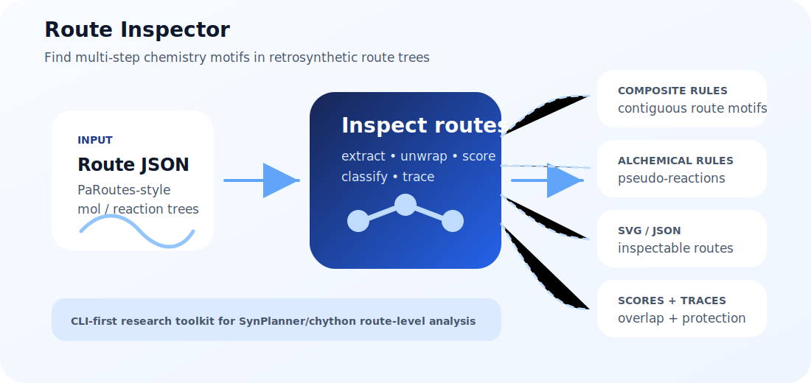

# Route Inspector

<p align="center">
  
</p>

<p align="center">
  <a href="LICENSE"></a>
  
  
</p>

**Route Inspector finds reusable multi-step chemistry patterns hidden inside
retrosynthetic route trees.** Feed it PaRoutes/SynPlanner-style route JSON and
get composite route rules, alchemical pseudo-reactions, SVG route depictions,
Retro-BLEU-like overlap scores, and protection/deprotection traces.

Route Inspector is a standalone SynPlanner/chython toolkit for route-level rule
analysis. It works with PaRoutes-style `mol`/`reaction` route trees and uses
SynPlanner rule extraction instead of RDKit/AiZynthFinder templates.

## Why use it?

Most retrosynthesis tooling focuses on individual reaction templates. Route
Inspector asks route-level questions:

- Which **contiguous reaction-center-sharing rule sequences** repeat across a
  route collection?
- Which composite-rule applications collapse into **alchemical pseudo-reactions**?
- Which discovered route fragments overlap a reference route vocabulary?
- Where are **protecting groups** introduced, inherited from stock, or removed?

## What it does

The package can:

- extract one-step rules and ordered composite rules from synthesis routes;
- keep only contiguous rule sequences whose adjacent reaction centers are shared
  or chemically connected by the route molecule;
- unwrap composite or alchemical rules back into route JSON/SVG depictions;
- collect alchemical rules by collapsing unwrapped routes into pseudo-reactions;
- classify alchemical rules against default one-step rules by QueryCGR identity;
- score extracted composite-rule overlap against reference route JSON files;
- analyze protection/deprotection strategies in mapped routes.

## Installation

Use an environment where `synplan` and `chython-synplan` are available. From the
repository root:

```bash
conda activate synplan
python -m pip install -e .
route-inspector --help
```

For development without installation, run the module directly:

```bash
python -m route_inspector.cli --help
```

## Quick start

Extract composite rules from a PaRoutes-style route JSON:

```bash
route-inspector extract-composite-rules \
  --routes-json data/clean/n1_routes.json \
  --output-dir outputs/n1/10_composite_rules \
  --config configs/rule_extraction_functional_groups.yaml \
  --ignore-errors
```

The command writes `*_t1_single_rules.tsv`, `*_t2_composite_rules.tsv`, larger
composite-rule TSVs, and a JSON extraction summary.

Apply a composite rule back to a target molecule and write an inspectable route
depiction:

```bash
route-inspector unwrap-composite-rule \
  --smiles 'CCO' \
  --composite-rule-tsv comp_output/n1/n1_t2_composite_rules.tsv \
  --row 0 \
  --output-json demo_out/unwrapped_route.json \
  --output-svg demo_out/unwrapped_route.svg
```

## Outputs at a glance

| Task | Command | Main outputs |
| --- | --- | --- |
| Composite route-rule extraction | `extract-composite-rules` | `*_single_rules.tsv`, `*_composite_rules.tsv`, extraction summary JSON |
| Alchemical rule collection | `extract-alchemical-rules` | alchemical rule TSV, pseudo-reaction `.smi`, summary/error sidecars |
| Rule classification | `classify-alchemical-rules` | positive/negative alchemical-rule TSV splits |
| Route unwrapping | `unwrap-composite-rule`, `unwrap-alchemical-rule` | route JSON and SVG depictions |
| Reference overlap scoring | `score-composite-overlap` | unique-rule, coverage, Jaccard, and popularity-weighted overlap scores |
| Protection analysis | `analyze-protection` | event tables, rule-family summaries, trace failures, network edges, summary JSON |

## Output organization

Keep canonical datasets under `data/` and generated command artifacts under
dataset-first stage directories:

```text
data/
  raw/
  clean/
outputs/
  n1/
    00_preprocess/
    10_composite_rules/
    20_alchemical_rules/
    30_alchemical_classification/
    40_scoring/
    50_protection_analysis/
```

Commands still accept explicit `--output` paths where they did before. Prefer
`--output-dir` for normal pipeline runs; standard filenames are inferred from the
dataset prefix, for example `n1_t2_composite_rules.tsv` and
`n1_alchemical_rules.tsv`. Stage directories also get generic `summary.json`,
`errors.tsv`, and `manifest.json` sidecars when possible.

Complete `n1` pipeline example:

```bash
python -m route_inspector.cli preprocess-routes \
  --input-dir data/raw \
  --output-dir data/clean \
  --datasets n1_routes.json \
  --summary-dir outputs \
  --config configs/rule_extraction_small.yaml \
  --ignore-errors

python -m route_inspector.cli extract-composite-rules \
  --routes-json data/clean/n1_routes.json \
  --output-dir outputs/n1/10_composite_rules \
  --config configs/rule_extraction_functional_groups.yaml \
  --ignore-errors

python -m route_inspector.cli extract-alchemical-rules \
  --composite-rule-tsv outputs/n1/10_composite_rules \
  --output-dir outputs/n1/20_alchemical_rules \
  --config configs/rule_extraction_functional_groups.yaml \
  --ignore-errors

python -m route_inspector.cli classify-alchemical-rules \
  --alchemical-rules-tsv outputs/n1/20_alchemical_rules/n1_alchemical_rules.tsv \
  --default-rules-tsv reference/pop_3_rules.tsv \
  --output-dir outputs/n1/30_alchemical_classification

python -m route_inspector.cli score-composite-overlap \
  --extracted-tsv outputs/n1/10_composite_rules \
  --reference-routes-json data/clean/n1_routes.json \
  --classification-tsv outputs/n1/30_alchemical_classification \
  --output-dir outputs/n1/40_scoring \
  --config configs/rule_extraction_functional_groups.yaml \
  --ignore-errors

python -m route_inspector.cli analyze-protection \
  --routes-json data/clean/n1_routes.json \
  --composite-rule-tsv outputs/n1/10_composite_rules \
  --alchemical-rules-tsv outputs/n1/20_alchemical_rules/n1_alchemical_rules.tsv \
  --output-dir outputs/n1/50_protection_analysis \
  --config configs/protection_analysis.yaml \
  --include-multicenter \
  --deprotection-first \
  --querycgr-compare \
  --ignore-errors
```

## Documentation

- `docs/composite_rules.rst`: extraction principles, output schema, large-run
  options, and composite unwrapping.
- `docs/alchemical_rules.rst`: alchemical extraction, pseudo-reaction output,
  classification, and alchemical unwrapping.
- `docs/protection_analysis.rst`: protection/deprotection tracing outputs and
  options.
- `docs/scoring.rst`: Retro-BLEU-style overlap scoring and positive/negative
  classification-aware metrics.
- `docs/tutorials.rst`: notebook map and recommended tutorial order.

Interactive examples live in `tutorials/`.

## Suggested repository topics

`cheminformatics`, `retrosynthesis`, `synthesis-planning`,
`reaction-informatics`, `synplanner`, `chython`, `chemical-reactions`,
`route-analysis`, `reaction-templates`, `python`

## Status

Route Inspector is early research software. The CLI is usable today, while the
packaging and demo assets are being improved to make installation,
reproducibility, and visual inspection smoother for new users.
